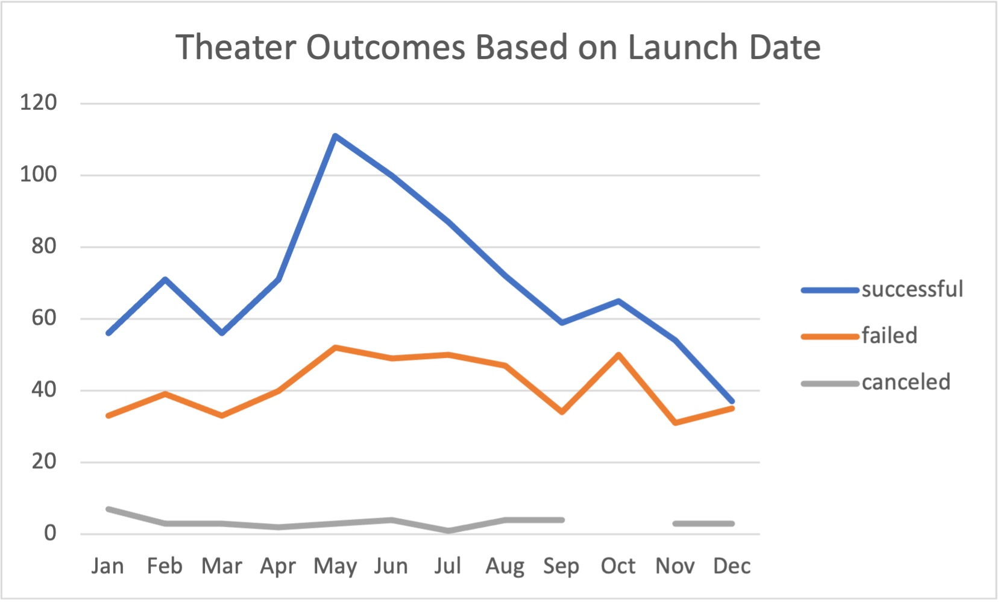
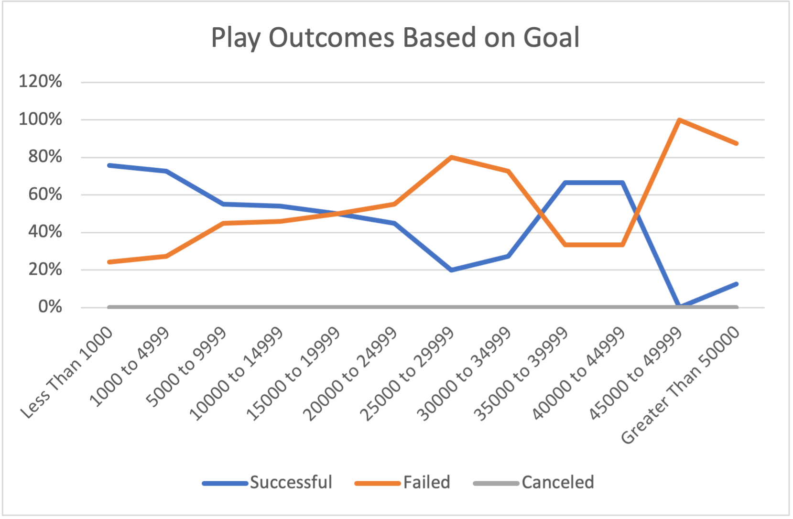

# An Analysis of Kickstarter Campaigns

## Overview of Project
Louise recently wrapped up a kickstarter campaign for her play, ‘Fever’. It unfortunately fell just short of goal. As part of her retrospect, Louise has come to me providing me with an excel file containing historical kickstarter campaign data to analyse. Louise is particularly interested in how campaigns performed by launch date and funding goals.

### Purpose
In order to glean characteristics from the provided sample of kickstarter campaigns, I used excel to clean, filter, visualize, and analyze provided crowdfunding data with the end goal of answering Louise's key questions and further, provide her with actionable insights she can use when designing future kickstarter campaigns.

## Analysis and Challenges

#### Overview of Analysis: 
- [Provided data included xyz, more info than needed. I used xyz

#### Challenges Encountered:  
- I encountered challenges when performing my analysis. Such difficulties included human error, namely typos in my excel formulas, and having to convert [name timestamp] to data type more manageable. [how they were overcome.]

### Analysis of Outcomes Based on Launch Date

### Analysis of Outcomes Based on Goals

### Challenges and Difficulties Encountered

`human error`

## Results

#### Outcomes based on Launch Date Conclusions

-
-

#### Outcomes based on Goals Conclusion

- 

#### Dataset limitations

-

#### Further Analysis

- possible tables and/or graphs that we could create
